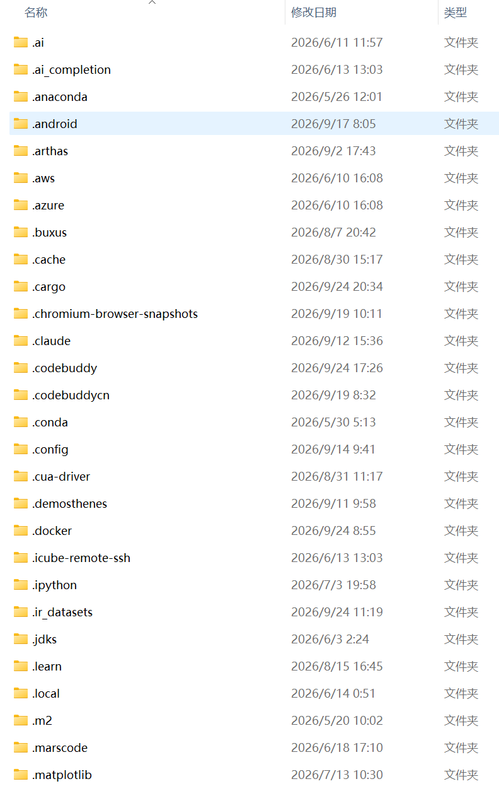

# ruyix

## 发行形态（已拍板）

**一个可执行文件 + `global/` + `projects/` + `plugins/`。绿色、简洁。**

```text
ruyix/                  ← 解压即用；卸载 = 删掉这个文件夹
├── ruyix.exe           ← 单文件
├── global/             ← 全局配置 + 全局数据（都在这一层里）
├── projects/           ← 项目数据，一个项目一个桶
└── plugins/            ← 插件（后期的口子）
```

- **零残留**：程序写下的一切都在 exe 同目录 —— 不进你的用户主目录，也不进你的代码仓库。
- **不污染被打开的项目**：打开一个项目只读它；IDE 自己的状态（暂存 / 备份 / 会话 / 进程日志 /
  验证产物 / 项目作用域配置）全落在 `projects/<项目>/` 里。跑完一轮 agent，你仓库的
  `git status` 里只有你自己的改动。
- **删文件夹即卸载**：没有注册表、没有服务、没有藏在 `%APPDATA%` 里的第二份数据。

### 项目记忆（核心模块，1.1）

**记忆不是插件。** 它随发行包强制安装，数据落在 `<根>/global/memory/`：

```text
global/memory/
├── mem.db                     ← 账本（只追加、哈希链）+ 折叠出的当前信念 + 收据
└── model/bge-small-zh-v1.5/   ← 本地嵌入模型（512 维，candle 纯 Rust 推理，不需要 Python）
```

- **历史一条不丢**：所有观察与修订决策都进只追加账本，永不删除；被推翻的内容只是"离开当前事实"，
  仍能按时间点查回（`as-of`）并按依据追查（`why`）。
- **前文能被后文推翻**：检索**先结构性过滤**（被替代/被撤销的槽位不进候选），再打分 —— 不是降权。
- **上下文有界**：注入模型的是有界信念块，超出的条目**留下收据**（丢了什么、怎么换回来）。
- **模型文件不进 git**：仓库里只有**取模型步骤**（`node scripts/fetch-embed-model.mjs`），
  打包时下到包里（`node scripts/package-portable.js` 会自动跑）；逐文件 sha256 落 `model.json`。
- 没有模型也能跑：向量腿缺席时自动退化为纯词法检索，并在注入块里**说明**这件事。

### 两种编译模式：预装 / 纯净（1.0.0）

**语法高亮在 ruyix 里是一枚插件**（`plugins/highlight/ruyix-builtin/`）：语言表、扩展名、图标、
token 配色全在插件里，IDE 只提供把它跑起来的机制。所以有两种编法：

| 模式 | 怎么打 | 里面有什么 |
|---|---|---|
| **预装**（默认） | `node scripts/package-portable.js` | 内置 tree-sitter 解析器（8 门语言）+ 首启把 `ruyix-builtin` 物化进 `plugins/highlight/` |
| **纯净** | `node scripts/package-portable.js --mode pure` | **一个解析器都不编、一个插件都不预装**；`plugins/` 空着，由你放自己的插件 |

纯净模式下没有插件认领的文件按**纯文本**显示，状态栏会直说原因（明确的降级，不是故障）。
两种模式的差异由 `node scripts/highlight-modes-probe.mjs` 跑**真 exe** 验证；
插件格式 / 留痕位置 / 信任边界（`dll:`、`service:` 本版本不开）见 `doc/highlight-plugins.md`。

### 下载与安装（1.0.0）

- **发行包**：`ruyix-1.0.0-win-x64.zip`（约 9 MB）—— 解压到任意可写目录（例如 `D:\ruyix`），
  双击 `ruyix.exe` 即可；随包有 README / LICENSE / `SHA256SUMS.txt` 可校验。
- **也可以只拷 `ruyix.exe`**：丢进一个空文件夹双击，它会自己长出 `global/ projects/ plugins/`。
- **数据位置固定下来**（脚本 / 只读介质 / 多环境）：`set RUYIX_HOME=D:\ruyix-data`。
- **备份** = 拷走整个文件夹；**卸载** = 删掉整个文件夹。
- **两条边界**（都有原生弹框说清原因，不会静默乱写）：放在**不可写的目录**（Program Files / 只读介质）
  → 拒绝启动；**从压缩包里直接双击**（Windows 会把程序解到临时目录）→ 提示"必须解压后试用"。
- 自己做包就是一条命令：`node scripts/package-portable.js`（构建 + sha256 + zip + 解压自校验）。

> **本版没有迁移步骤**：0.x 的旧残留是一次性的、已清完，1.0.0 里**没有读旧路径的代码分支**。
> 细节与已知问题见 [`doc/release-v1.0.0.md`](doc/release-v1.0.0.md)（中英双栏）。


### 他们的软件是这么干的



上面这一屏**不是我们的**：这是各种 IDE / 工具链在用户主目录里留下的脚印 —— 配置、缓存、SDK、
模型权重各占一个隐藏目录，卸载了也不走。ruyix 反过来做：**一个文件夹，说删就删。**

## 来源说明

### 原项目

本项目的早期版本由**一位女性程序员**开发并维护，她以笔名「醒过来摸鱼」在 GitCode 上发布
（CSDN 同名账号），后因**工作繁忙**停止了该项目的维护。

- 原项目地址（GitCode）：<https://gitcode.com/m0_66201040/darkhorse-code>

### 迁移说明

经**原作者同意**，本项目已迁移至 GitHub 继续开发与维护：

- 当前仓库（GitHub）：<https://github.com/YujianboIsMe/ruyix>
- 现维护者：俞建波 `<yujianboisme@outlook.com>`
- 迁移保留了完整提交历史，包括 `master` / `0.0.2` / `0.0.3` 分支与 `0.0.1` 标签
- 历史提交中署名为「醒过来摸鱼」的提交均出自原作者；迁移至 GitHub 后的提交由现维护者提交

原项目地址已在上方注明，用于标明项目来源与原作者的署名。

### 其他说明

- 仓库内第三方内容版权归其原作者，遵循各自许可证（如 vendored 的 `ui/xterm.js`、`ui/xterm.css` 为 MIT）
- 感谢原作者的开源贡献
- 如对来源或署名有异议，请提 issue 联系更正

## 架构
Tauri 2 + Monaco Editor + Rust后端
这个方案已经被SideX等开源IDE验证，是目前Rust+WebView路线做IDE的最优解。
核心优势是把编辑器渲染交给久经考验的Monaco，后端用Rust处理所有重逻辑，通信走Tauri原生IPC替代WebSocket。
语法高亮架构：tree-sitter+ arborium
终端架构：xterm.js + Rust PTY

## AI Agent 引擎（harness-engine）
`crates/harness-engine`：从 darkhorse-harness 一次性迁入的 Agent 引擎（零 tauri 依赖的 lib crate），
实现「规划 → 生成 → 规约 → 验证 → 自修复」闭环，含 194 个单测。
工具循环只有四种原子能力（读 / 写 / 执行 / 连接），交付前有**质量门禁**：机械验证（改动后跑语法层、
交付前跑语法+单测+规约，未通过不放行）+ 干净上下文的复核 agent（只读、结构化结论、结论回灌主循环）。
后端桥 `src-tauri/src/agent/`（`agent_*` 命令 + `agent://*` 事件流），
前端面板见导航区「智能体」标签（无后端时自带演示回放）。详见[融合计划](doc/v0.x/融合计划-Agent集成-v0.2.md)与
[需求：验证与反思](doc/v0.x/需求-Agent-验证与反思-v0.3.md)。

## 界面
[界面](doc/ui.md)

## 配置系统
[配置](doc/config.md)

## 命令系统
[命令系统](doc/command.md)

## 运行时
运行时分两种状态：
1. 无项目状态
2. 打开项目状态

## 运行
运行和配置系统有关联。
详见[配置](doc/config.md)
暂时先不实现真正的运行，只是保存和显示运行目标。

在【工作区-导航区-运行目标】里先列举所有的运行目标
显示运行目标的名称，如果运行目标有name属性，则显示name，如果没有则显示它的code，如'target0'
具体的点击运行暂不实现

## 终端
终端是运行的关键，也是调试程序的关键。
xterm.js + Rust PTY 实现终端。
导航区-终端暂不实现。

先实现【导航区-运行目标】

运行时，先在编辑器里打开新标签页，标签页的名字为运行目标名称。
然后在该标签页模拟终端执行运行目标的命令。
分两种场景：
- 运行目标没有系统输出，如notepad.exe，这种情况不必在编辑器打开新的标签页
- 运行目标有系统输出，如python.exe，这种情况在编辑器打开新的标签页使用模拟终端运行。