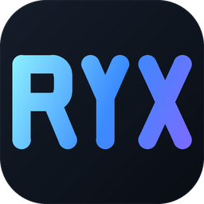
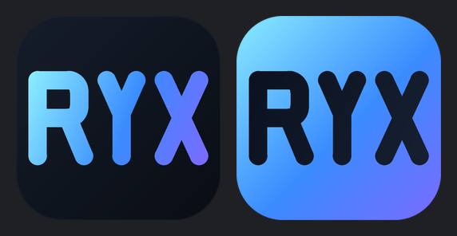

# 应用图标（RYX 字母标）

## 是什么

三字母几何单线字：R / Y / X 落在同一条字带上、同一笔宽、同一套圆头圆角，
X 的两条斜线与 Y 的两臂同倾角 —— 三个字要是一套东西，不是三个字形硬凑。
底色是一枚圆角方（squircle，圆角 22.7%）压在深色渐变上，字母走青→蓝→靛的渐变。
配色与界面同源（`--accent: #007acc` 一族），不在应用图标上另开一套色。



## 唯一的真相源

**`tools/logo/build_logo.py`**。几何参数（字宽 / 字高 / 笔宽 / 碗高 / 圆角 / 配色）
只在这个文件里写一份，它同时产出：

| 产物 | 用途 |
|---|---|
| `ui/logo/logo.svg` | 应用图标（深底）—— 主用，README 与 favicon 都用它 |
| `ui/logo/logo-light.svg` | 浅底版，给浅色文档 / 白底投影稿用 |
| `ui/logo/logo-mark.svg` | 只有字母（透明底、带渐变），放界面内用 |
| `ui/logo/logo-mono.svg` | 只有字母、`stroke="currentColor"`，跟着父元素染色 |
| `src-tauri/icons/*` | Tauri 要的那一整套 PNG / ICO / ICNS（桌面端） |

```bash
python tools/logo/build_logo.py            # 重新生成 SVG（图标那套下面单独跑）
python tools/logo/build_logo.py --check    # 只校验 SVG 是否与几何一致（不写文件）
```

**为什么要脚本**：Tauri 需要 20 个位图尺寸 + ico + icns。手画 SVG 再逐个导出，
改一次 SVG 就要重导一遍 —— 迟早只改其中一个，矢量源与图标就此分家。
写成脚本后，改一个数字、重跑两条命令，两边同时变。

### 重新生成 Tauri 图标

```bash
cargo tauri icon ui/logo/logo.svg -o src-tauri/icons
```

`cargo tauri icon` 认 SVG（内部走 resvg），所以**不需要**中间 PNG。
它顺带会生成 `icons/ios/` 与 `icons/android/`，本项目只做桌面端，用完删掉：

```bash
rm -rf src-tauri/icons/ios src-tauri/icons/android
```

位图由 resvg 渲染、矢量源与几何同源，两者实测平均像素差 0.9/255（纯抗锯齿差异）。

## 几何与配色

| 项 | 值 | 备注 |
|---|---|---|
| 画布 | 1024 × 1024 | |
| 描边宽度 | 92（9%） | 32px 下约 2.9px |
| 字高 | 380（描边中心线 322→702） | 外框 472 |
| 字宽 | R 292 / Y 236 / X 264 | **逐字设定**，等宽会把 R 的字腔压成方块 |
| 字距 | 46 | |
| R 碗 | 高 190（字高 50%）/ 外圆角 55 | 字腔 116×98，是横长方形 |
| R 斜腿 | 起笔在碗的右下圆角端点，末端外扩 24 | 起笔偏左会多出一截横条，读着像 "ᛒ" |
| Y 交汇点 | y=490 | 约字高 44% |
| 圆角方 | rx 232（22.7%） | Windows / macOS 通用的应用图标比例 |
| 字母渐变 | `#8AECFF` → `#3B8BFF` → `#7A6BFF` | 斜向 135°，起点 (62,322) → (962,702) |
| 底色渐变 | `#151D2A` → `#090D14` | |
| 内描边 | `rgba(255,255,255,.062)`，1.5px | 让图标有厚度，暗背景上不"糊在底里" |

## 候选：反色版

亮渐变底 + 深色字（任务栏上更跳）。生成器已实现，只在预览里出，**没有**落成正式资产：



```bash
python tools/logo/build_logo.py            # 预览落在 target/logo-preview/candidate-invert-1024.png
```

要转正的话，把 `render_icon` 的 `invert=True` 作为默认、重跑两条命令即可。

## 门禁

`scripts/ui-smoke.js` 的 **U27 logo-assets** 钉四条：

1. 四个矢量变体都在（且是三笔圆头描边）；
2. `logo.svg` 与 `logo-mark.svg` 的字母轮廓**逐字节相同**（只改一份 = 漂移的开始）；
3. `tauri.conf.json` 的 `bundle.icon` 非空、且**每个文件真在磁盘上**；
4. `icon.ico` 是多尺寸（≥4），且 `icons/` 下没有 ios/android。

第 3 条最值钱：`bundle.icon` 缺失时**换了图也不生效** —— 窗口图标取自它，
exe 的图标资源也是它（`tauri-build` 读这个字段写进 Windows 资源）。
